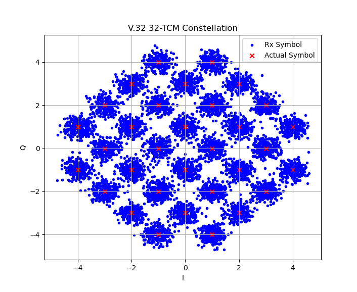
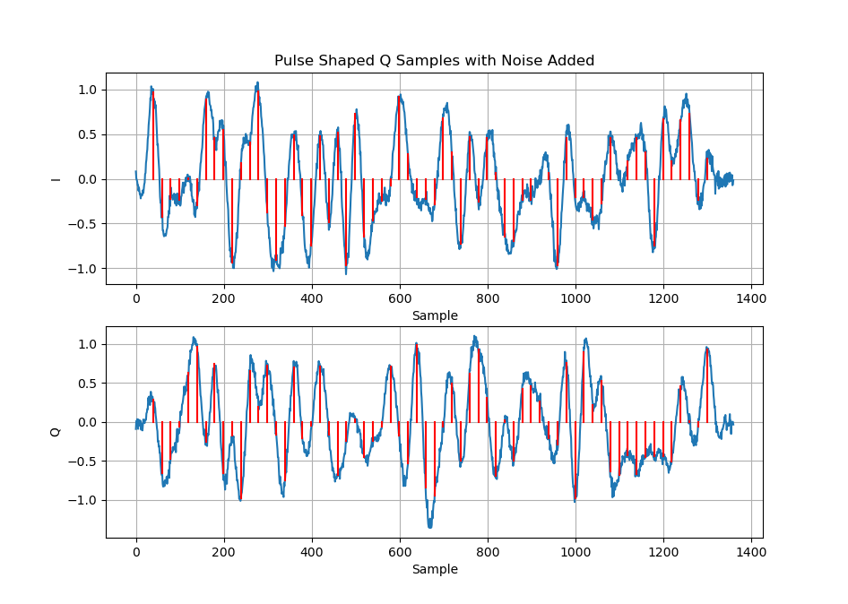

# V.32_python_modulator

## Description
Implementation and simulation of V.32 32-Trellis coded modulation scheme with viterbi algorithm decoder

## Features
The simulation steps include:

1. Scrambling using the GPC polynomial
2. Encoding using trellis coding with 32 carrier states (32-TCM)
3. Padding and oversampling for filtering
4. Pulse shaping using a raised cosine FIR filter
5. AWGN noise addition for arbitrary SNR setting
6. Resampling
7. Decoding using the Viterbi algorithm
8. Descrambling using the GPC polynomial
9. Symbol and Bit error rate calculations and plotting

The simulation does not currently include synchronization or channel equalization, nor higher level layers handling the V.32 standard.

## Results
The implementation works well, and the utility of the trellis coded modulation and coding was clearly evident as SNR increased. A simulation was run to determine BER performance vs SNR and is shown below.

Pulse shaping behaviour however, was not as expected. In the bandwidth limited regime of audio phone lines, a system would benefit from a fast roll-off factor for pulse shaping filters to minimize bandwidth, however typical beta values of 0.25 suggested by sources when tested resulted in unexpectedly worse performance.

A beta value 0.1 was decided after some testing to not incur unnecessary additional errors. In a more realistic sampling simulation, a higher beta would be better, however, the error could be in my implementation of the filter and noise addition. A time domain plot of the I and Q values over time is shown below, the overlaid vertical lines indicating the ideal sample times and values as impulses.

## Future Considerations
The one area which I would revisit is implementing a fractional delay and frequency offset into the channel to then implement synchronization. Additionally, implementing equalization of the channel would also be of interest.
Both would be easy to add with the compartmentalization of the `trellis_coded_modulator` class.

## Sources
1. *Analog Devices ADSP‑2100 Family Applications Handbook, Vol. 4,* Analog Devices / Bitsavers. [Online]. Available: [https://bitsavers.trailing‑edge.com/components/analogDevices/dsp/ADSP‑2100_Family_Applications_Handbook_Vol_4_1990.pdf](https://bitsavers.trailing‑edge.com/components/analogDevices/dsp/ADSP‑2100_Family_Applications_Handbook_Vol_4_1990.pdf)

2. ITU‑T Recommendation V.32bis (02/91), *A duplex modem operating at data signalling rates of up to 14 400 bit/s for use on the general switched telephone network and on leased point‑to‑point 2‑wire telephone‑type circuits,* Feb. 1991. [Online]. Available: *[T‑REC‑V.32bis‑199102‑I!!PDF‑E.pdf](https://www.itu.int/rec/T-REC-V.32-199303-I)* 

3. Texas Instruments, *AN‑SPRA099 Application Report.* [Online]. Available: [https://www.ti.com/lit/an/spra099/spra099.pdf](https://www.ti.com/lit/an/spra099/spra099.pdf)

4. J. G. Proakis and M. Salehi, *Fundamentals of Communication Systems,* 2nd ed., Upper Saddle River, NJ, USA: Pearson/Prentice Hall, 2014.

